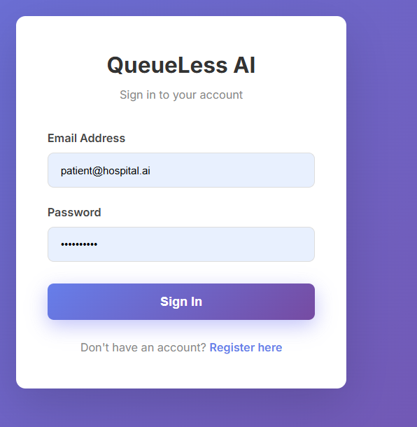
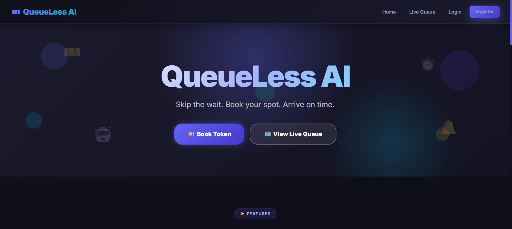
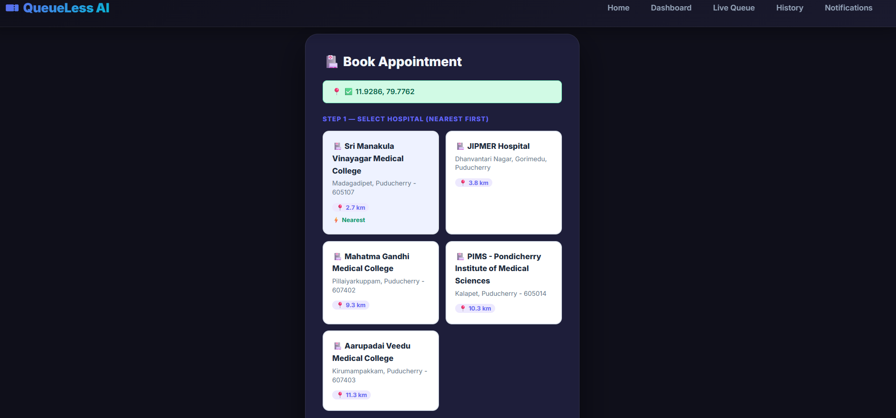
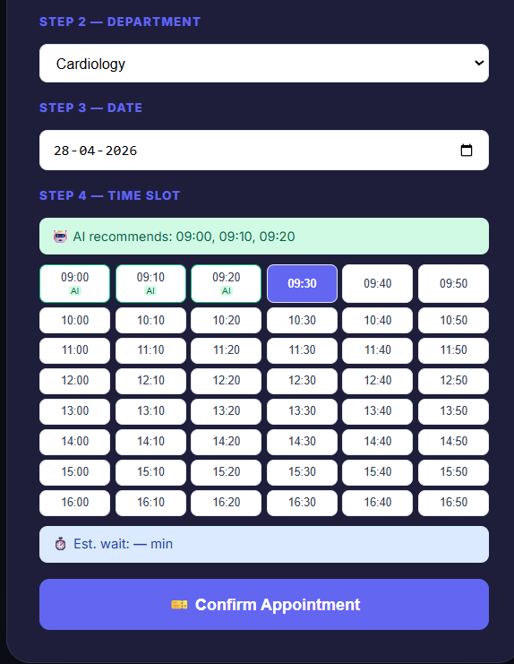
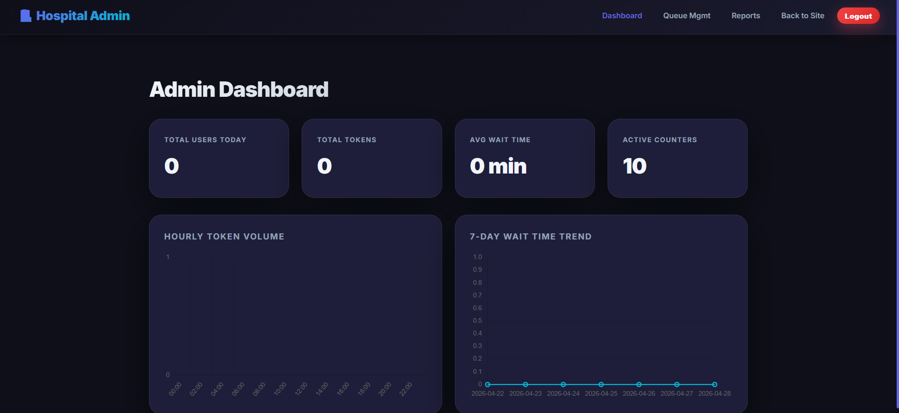
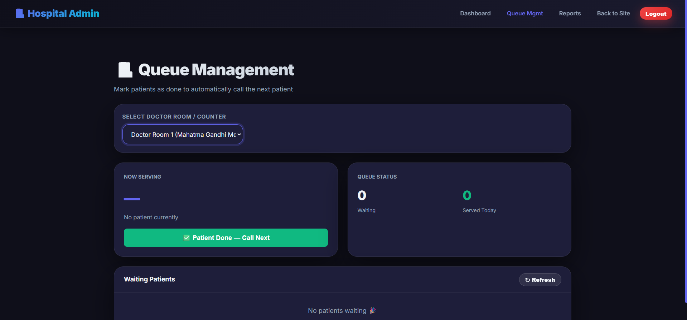
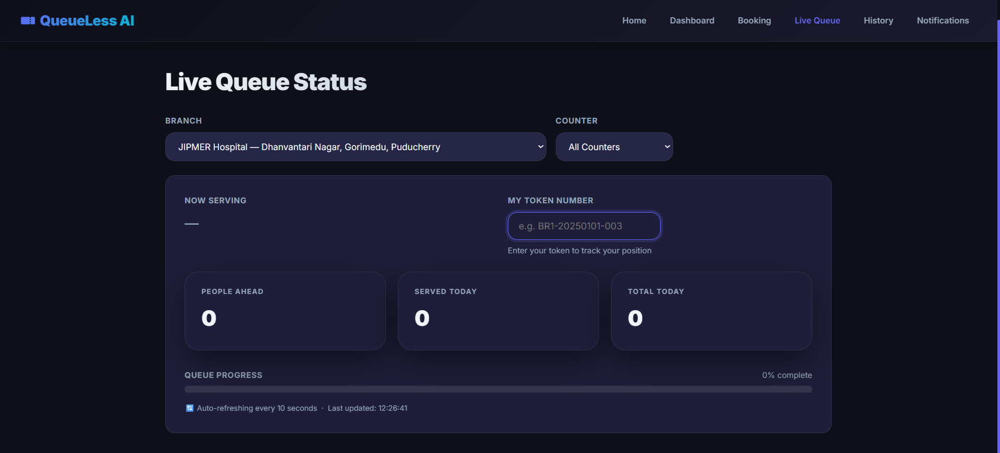
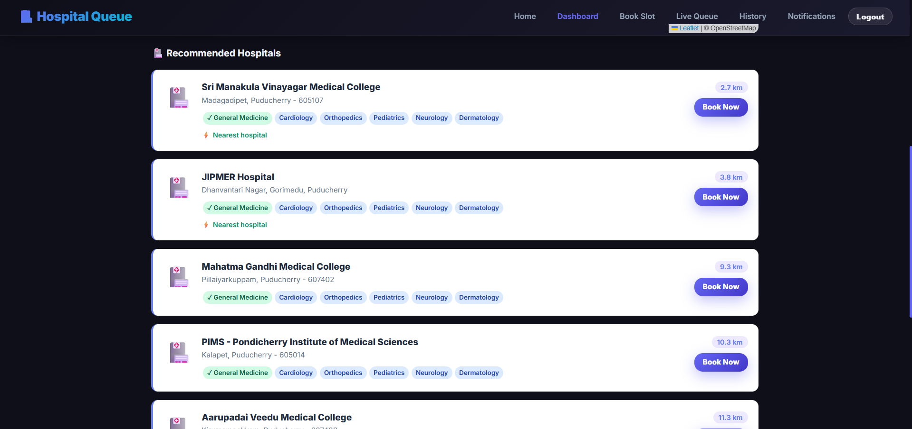

# 🏥 QueueLess AI — Hospital Queue Management System

An intelligent hospital queue management system powered by **RAG (Retrieval-Augmented Generation)** and **MCP (Model Context Protocol)**.

## 🚀 Features

- **Patient Booking** — Book appointments with 10-minute time slots (09:00, 09:10, 09:20...)
- **Admin Queue Control** — Mark patients as done, auto-notify next patient
- **AI Insights (RAG + MCP)** — GPT-4o powered queue recommendations via Model Context Protocol
- **Nearby Hospitals** — Browser geolocation + OpenStreetMap to find nearest hospitals
- **Live Queue Monitor** — Real-time queue status, auto-refreshes every 10 seconds
- **Notifications** — Automatic in-app alerts when it's your turn

## 🏗️ Architecture

```
Browser (HTML/CSS/JS)
       ↕ REST API (JSON)
Flask Backend (Python)
       ↕ SQLAlchemy ORM
SQLite Database
       ↕
AI Layer:
  ├── RAG Engine (app/services/rag_engine.py)
  │     Retrieve → Augment → Generate
  └── MCP Client (app/services/mcp_client.py)
        Model Context Protocol → OpenAI GPT-4o
```

## 🧠 AI Concepts Implemented

### RAG (Retrieval-Augmented Generation)
Located in `app/services/rag_engine.py`:
1. **Retrieve** — Query SQLite for 30 days of patient appointment history
2. **Augment** — Compute avg wait time, peak hours, crowd scores per slot
3. **Generate** — Pass enriched context to GPT-4o via MCP for natural-language insights

### MCP (Model Context Protocol)
Located in `app/services/mcp_client.py`:
- Implements the MCP tool-calling pattern
- Defines structured tools: `queue_insights`, `slot_recommendation`
- Sends tool call requests to OpenAI GPT-4o
- Falls back to template-based responses if API key not set

### Agentic Framework
The system uses an agent-like loop:
1. Admin marks patient done → triggers agent
2. Agent finds next patient → updates status → sends notification
3. Patient receives alert → proceeds to counter

### Guardrails
- Input validation on all API endpoints (400 for missing fields)
- Role-based access control (`@require_role('admin')`)
- One active token per patient per hospital (409 conflict)
- Password strength enforcement (min 8 chars + 1 digit)

### Observability
- Python `logging` module throughout all services
- MCP calls logged with tool name and args
- RAG pipeline steps logged (retrieve count, computed stats)

## 📁 Project Structure

```
queueless-ai/
├── app/
│   ├── blueprints/          # Flask route handlers
│   │   ├── auth.py          # Login, register, logout
│   │   ├── admin.py         # Admin dashboard + queue control
│   │   ├── tokens.py        # Patient token booking
│   │   ├── queue.py         # Live queue status API
│   │   ├── predict.py       # AI prediction endpoints
│   │   ├── notifications.py # In-app notifications
│   │   ├── branches.py      # Hospital/department data
│   │   └── pages.py         # HTML page routes
│   ├── services/            # Business logic + AI
│   │   ├── mcp_client.py    # MCP protocol client (GPT-4o)
│   │   ├── rag_engine.py    # RAG pipeline
│   │   ├── predictor.py     # Wait time + crowd analysis
│   │   └── notification_service.py
│   ├── models.py            # SQLAlchemy database models
│   ├── extensions.py        # Flask extensions (db, login)
│   ├── utils.py             # Role-based access decorator
│   ├── seed.py              # Development seed data
│   └── __init__.py          # App factory
├── templates/               # Jinja2 HTML templates
├── static/                  # CSS + JavaScript
├── tests/                   # Unit + property-based tests
├── config.py                # App configuration
├── run.py                   # Entry point
└── README.md
```

## ⚙️ Setup Instructions

### 1. Clone the repository
```bash
git clone https://github.com/YOUR_USERNAME/queueless-ai.git
cd queueless-ai
```

### 2. Create virtual environment
```bash
python -m venv venv
# Windows:
venv\Scripts\activate
# Mac/Linux:
source venv/bin/activate
```

### 3. Install dependencies
```bash
pip install flask flask-sqlalchemy flask-login werkzeug hypothesis pytest openai
```

### 4. Set environment variables (optional — for real MCP/GPT-4o)
```bash
# Windows:
set OPENAI_API_KEY=your-openai-api-key-here
# Mac/Linux:
export OPENAI_API_KEY=your-openai-api-key-here
```
> Without an API key, the system uses template-based fallback responses.

### 5. Run the app
```bash
python run.py
```

### 6. Seed the database
```bash
python -c "from app import create_app; from app.seed import seed_db; a = create_app(); a.app_context().push(); seed_db()"
```

### 7. Open in browser
```
http://localhost:5000
```

## 👤 Demo Credentials

| Role | Email | Password |
|------|-------|----------|
| Admin (Doctor) | admin@hospital.ai | Admin1234 |
| Patient | patient@hospital.ai | Patient123 |

## 🧪 Running Tests

```bash
pytest tests/ -v
```

## 🔑 Key Endpoints

| Method | Endpoint | Description |
|--------|----------|-------------|
| POST | /api/auth/login | Patient/Admin login |
| POST | /api/tokens/book | Book appointment |
| GET | /api/tokens/active | Get current token |
| GET | /api/queue/status | Live queue status |
| POST | /api/admin/queue/patient-done | Mark patient done (admin) |
| GET | /api/admin/queue/current | Current serving + waiting list |
| GET | /api/rag/insights | AI queue insights (RAG+MCP) |
| GET | /api/predict/best-slots | Top 3 recommended slots |
| GET | /api/branches | Nearby hospitals with coordinates |

## 📊 Testing Strategy

- **Property-based tests** (Hypothesis): Token uniqueness, password validation, queue consistency
- **Unit tests**: Booking validation, cancel, history, admin operations
- **Integration tests**: Full API endpoint testing with in-memory SQLite

## 🌐 Technologies

- **Backend**: Python, Flask, SQLAlchemy, Flask-Login
- **Database**: SQLite
- **AI/ML**: OpenAI GPT-4o (via MCP), RAG pipeline
- **Frontend**: HTML5, CSS3, Vanilla JavaScript, Chart.js
- **Maps**: OpenStreetMap + Leaflet.js (no API key needed)
- **Testing**: pytest, Hypothesis (property-based testing)

## 📸 Screenshots

### Login Page


### Front Page


### Patient Dashboard


### Appointment Booking


### Appointment Slot Selection


### Admin Dashboard


### Admin Queue Management


### Live Queue Dashboard


### Nearby Hospital Recommendation

